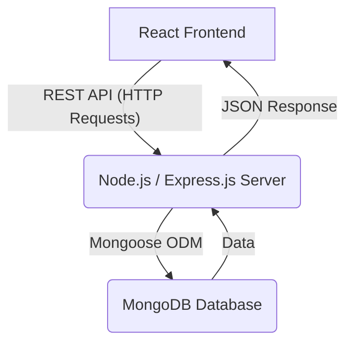

# VidyaVichar MERN Project Files

This block contains all the necessary files to build the VidyaVichar application. Each file is clearly marked with its correct path and content.

---

### **File: `README.md`**

```markdown
# VidyaVichar - Classroom Q&A Sticky Board

VidyaVichar is a real-time classroom Q&A platform built with the MERN stack. It allows students to post questions during lectures, which appear as organized sticky notes for the instructor to view, manage, and answer, creating a more interactive and seamless learning environment.

---

## Solution Diagram

The application follows a classic client-server architecture. The React frontend communicates with the Express backend via a RESTful API. The backend handles business logic and interacts with the MongoDB database for persistent data storage.



## Folder Structure

The project is organized into a standard MERN stack structure with separate directories for the `frontend` and `backend`.

```


VIDYA_VICHAR_GROUP5/
├── backend/
│   ├── config/
│   │   └── db.js             # MongoDB connection logic
│   ├── middleware/
│   │   └── authMiddleware.js # JWT token verification
│   ├── models/
│   │   ├── User.js           # User data schema
│   │   ├── Class.js          # Class data schema
│   │   └── Question.js       # Question data schema
│   ├── .env                  # Environment variables (MONGO_URI)
│   ├── package.json
│   └── server.js             # Express server and API routes
│
├── frontend/
│   ├── src/
│   │   ├── App.jsx           # Main React application component
│   │   ├── index.css         # Tailwind CSS directives
│   │   └── main.jsx          # React entry point
│   ├── index.html            # Main HTML file
│   ├── package.json
│   ├── tailwind.config.js    # Tailwind CSS configuration
│   └── postcss.config.js     # PostCSS configuration
│
└── README.md                 # Project documentation

```
## MERN Implementation Details


### Frontend (React)


* ​**Framework**​: React.js (v18)
* ​**State Management**​: React Context API is used for managing global application state, specifically for user authentication. This provides a lightweight yet powerful way to share user data across all components without prop-drilling.
* ​**Styling**​: Tailwind CSS is used for utility-first styling. This allows for rapid UI development and ensures a consistent and clean design system.
* ​**Structure**​: The entire frontend is structured within a single `App.jsx` file. This contains all components (login, calendar, classroom view, etc.) and the core application logic. This consolidated approach simplifies the development process for this project's scale.


### Backend (Node.js & Express.js)


* ​**Framework**​: Express.js is used to create a robust and scalable REST API.
* ​**Authentication**​: A token-based authentication system is implemented using JSON Web Tokens (JWT). When a user logs in, the server provides a secure token, which is then sent with every subsequent request to access protected routes. Passwords are securely hashed using `bcryptjs`.
* ​**Middleware**​: A custom authentication middleware (`authMiddleware.js`) is used to protect API routes, ensuring that only authenticated users can perform certain actions.
* ​**Directory Structure**​:
  * `models/`: Contains the Mongoose schemas that define the structure of the `User`, `Class`, and `Question` documents in the database.
  * `config/`: Holds the database connection logic.
  * `middleware/`: Contains middleware functions, such as the one for JWT verification.


### Database (MongoDB)


* ​**Type**​: MongoDB is a NoSQL, document-based database, which offers flexibility and scalability, making it a great fit for the MERN stack.
* ​**ODM**​: Mongoose is used as an Object Data Modeling (ODM) library to interact with MongoDB in an object-oriented way. It provides schema validation and simplifies database operations.
* ​**Collections (Models)**​:
  1. ​**`users`**​: Stores user information, including a hashed password and their role (professor or student).
  1. ​**`classes`**​: Stores details about each class, including its name, date, and a reference to the professor (`professorId`) who created it.
  1. ​**`questions`**​: Stores each question posted, with references to the class (`classId`) it belongs to and the student (`studentId`) who asked it.

---


## Design Decisions


* ​**Architecture**​: The MERN stack was chosen as required, and it provides a cohesive development experience with JavaScript used across the entire application. The clear separation between the frontend and backend allows for independent development and scaling.
* ​**Authentication**​: JWT was selected for authentication because it is a stateless, industry-standard solution. The server does not need to store session information, making the application more scalable. Hashing passwords with `bcryptjs` is a critical security measure to protect user credentials.
* ​**User Interface**​: A calendar-based navigation system was chosen for the homepage as it provides an intuitive and visual way for both students and professors to find and access classes based on their scheduled dates.
* ​**Real-time Feel**​: Although the application does not use WebSockets, the logic is designed to re-fetch data after key actions (like creating a class or asking a question). This simulates a real-time experience by ensuring the user's view is always up-to-date with the latest data from the server.

---


## Setup and Installation Steps


Follow these steps to get the project running on your local machine.


### Prerequisites


* Node.js and npm installed
* MongoDB installed and running locally (or a MongoDB Atlas connection string)


### 1. Backend Setup
```
# Navigate to the backend directory

cd backend

# Install all required npm packages

npm install

# Create a .env file in the backend root

# Add your MongoDB connection string to this file

# For a local database:

# MONGO_URI=mongodb://localhost:27017/vidyavichar

# For a remote database (Atlas):

# MONGO_URI=mongodb+srv://<username>:<password>@<cluster-url>/...

# Start the backend server (runs on http://localhost:8080)

npm run dev

```
2. Frontend Setup
```

# In a new terminal, navigate to the frontend directory

cd frontend

# Install all required npm packages

npm install

# Start the React development server (runs on http://localhost:3000)

npm run dev

```
You can now access the VidyaVichar application in your browser at `http://localhost:3000`.


# Assumptions
```

1. We are assuming that Teaching Assestents can login as students as students to check the doubts.
2. We are assuming anyone who is a student can join the class and ask doubts.

```


